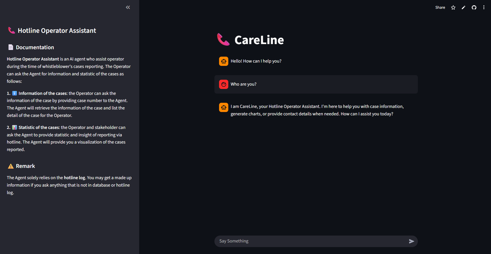
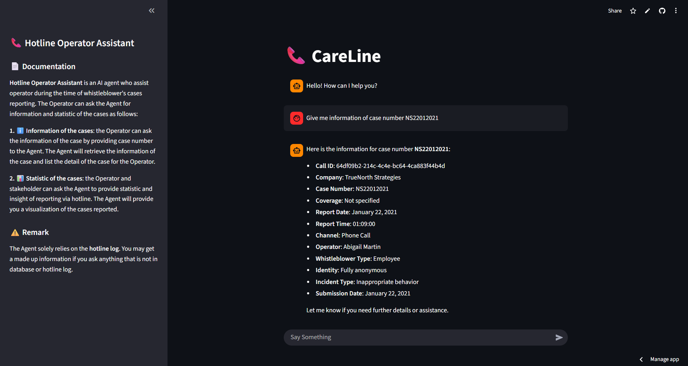
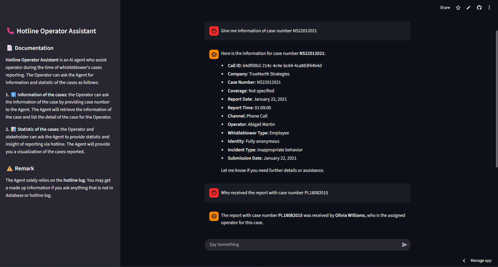
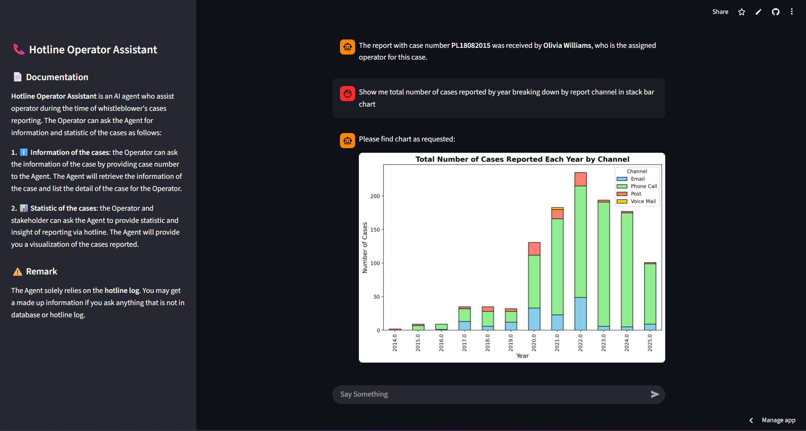

# CareLine
**Description**: 

Hotline Operator Assistant designed to support hoeline staff in providing accurate and timely response. CareLine assists the operator by retreiving relevant information from the incident log, service knowledge, supporting the operator in responding the whistleblower's follow-up questions and presenting visualization of case statistics to hotline manager.

## Visit CareLine

[📞 CareLine Agent](https://careline-agent-7e9otkdw7etszahk6vqznm.streamlit.app/ "CareLine Agent")

## 📄 Documentation
**Hotline Operator Assistant** is an AI agent who assist operator during the time of whistleblower's cases reporting.
The Operator can ask the Agent for information and statistic of the cases. The Agent provide the information of specific cases upon the Operator request as below:

1. ℹ️ **Information of the cases**: the Operator can ask the information of the case by providing case number to the Agent.
The Agent will retrieve the information of the case and list the detail of the case for the Operator. For example, you ask the agent to provide you the operator who received the report for case number **PL18082015** and the Agent provide name of the Operator.

2. 📊 **Statistic of the cases**: the Operator and stakeholder can ask the Agent to provide statistic and insight of reporting via hotline. The Agent will provide you a visualization of the cases reported. For example, you ask the Agent to summarize total number of case reported by year breaking down by report channel in stack bar chart. The Agent provide you the chart as follows:

## ⚠️ Remark
The Agent solely relies on the **hotline log**. You may get a made up information if you ask anything that is not in database or hotline log.